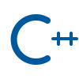
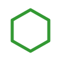
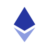
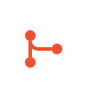

<table>
  <tr>
    <td>
      
    </td>
    <td>
      <pre>
Name:     Sushovan Ghosh
Location: Kolkata, India
Focus:    Full-Stack &amp; Web3 Developer
Langs:    C, C++, Python, JavaScript, TypeScript, SQL
GitHub:   github.com/MIRACULOUS65
LinkedIn: linkedin.com/in/sushovan-ghosh
Email:    sushovan1908@gmail.com
      </pre>
      
    </td>
  </tr>
</table>

## About Me

I'm Sushovan Ghosh, an aspiring full-stack and Web3 developer based in Kolkata, India, currently pursuing my B.Tech CSE, Techno India University. I enjoy building end-to-end web applications and am equally drawn to Web3/decentralized architectures, exploring how blockchain-based systems can rethink traditional application design. Outside of building projects, I regularly practice competitive programming to sharpen my problem-solving and algorithmic thinking. I'm always looking to deepen my skills across the full stack while staying curious about emerging decentralized technologies.

## Known Technologies

Icons are animated SVGs — open the README on GitHub to see them move.

**Languages**

**Frontend**

**Backend**

**State Management**

**Databases**

**Blockchain**

**DevOps & Tools**

## GitHub Stats

<table>
  <tr>
    <td></td>
    <td></td>
  </tr>
  <tr>
    <td colspan="2" align="center"></td>
  </tr>
</table>
